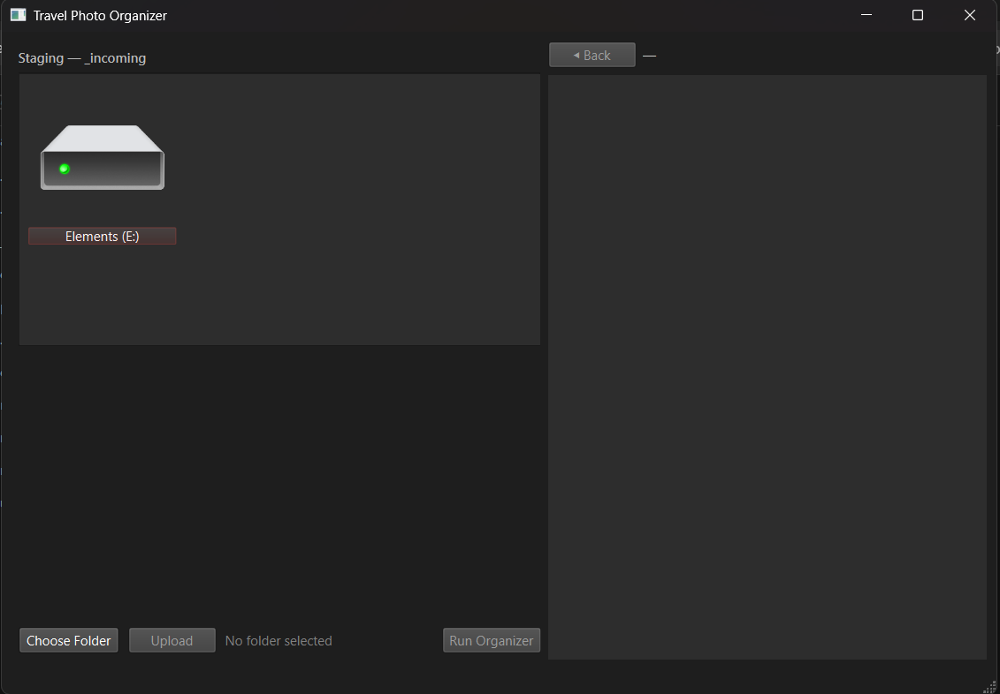

# **Travel Photo Organizer**

A simple tool that automatically sorts, cleans, and organizes your travel photos using a friendly interface.
Beginner-friendly — just install Python, download the project, and double-click one file to start.

---

## 🚀 Quick Start

### **1. Install Python (Required)**

Download **Python 3.12 (recommended)** from:

[https://www.python.org/downloads/windows/](https://www.python.org/downloads/windows/)

During installation, **check “Add Python to PATH.”**

---

### **2. Download the App**

1. Go to this repo page and download the ZIP file.
2. Extract the folder anywhere on your PC

---

### **3. Run the App**

Double-click:

```
run_organizer.bat
```

The app will:

* Install required Python packages automatically (first run only)
* Launch the graphical interface
* Guide you through choosing your photo folder and organizing it

---

## 🎯 What the App Does

* Lets you **select a photo folder** (e.g., from your phone or external drive)
* Automatically extracts:

  * **Date taken**
  * **Location metadata**
  * **Camera information**
* Organizes photos into a clean structure like:

```
2023/
   07/
   12/
2024/
   01/
```

* Removes or isolates:

  * Hidden iOS/Android trash files
  * Broken or corrupt files
  * Duplicate images
* Creates logs so you can track what happened
* Never deletes originals without moving them safely

---

## 🖼️ User Interface (First Launch)

The app opens to a simple UI with:

* **Choose Folder** – Select your photos
* **Upload** – Stage the selected photos
* **Run Organizer** – Process & sort them
* **Back** – Return to previous screen



---

## 📂 Workflow

1. Connect your phone / camera / drive
2. Open the app
3. Click **Choose Folder** to choose a folder for storing your photos/videos. (default: photos_to_organize)
5. Click **Upload** to select photos/videos that are going to be organized
6. Click **Run Organizer**
7. Wait for processing to finish
8. Your organized photos will appear in the output structure

---

## ⚠️ Important Notes

* Your original files are **never destroyed**.
  The app always copies the files instead of moving.
* Avoid disconnecting drives while the organizer is running, for any unknown error occurred.
* For very large collections (50k+ photos), the first run may take a while.

---

## 🛠️ Requirements

* Windows 10 or 11
* Python **3.10 – 3.12** (recommended: **Python 3.12**)
* Internet connection for the first launch (for dependencies)
* Sufficient free storage for organizing large batches

---

## 🗂️ Project Structure

```
photo-organizer-tool/
│
├── run_organizer.bat       # Main launcher
├── ui_app_qt.py            # GUI application
├── main.py                 # Organizer backend logic
├── requirements.txt        # Python dependencies
├── exiftool.exe            # Metadata extractor
├── exiftool_files/         # Required by exiftool
└── photos_to_organize/     # (User input folder, not uploaded to Git)
```

---

## 🔧 Developer Usage

If you prefer running without the batch file:

```bash
pip install -r requirements.txt
python ui_app_qt.py
```

---

## 📝 Troubleshooting

**The app doesn’t run?**
Make sure Python 3.12 is installed and `python` is recognized in your terminal.

**Pillow or PySide6 fails to install?**
Try updating pip:

```bash
python -m pip install --upgrade pip
```

**Photos didn’t organize correctly?**
Check the log:

```
test/organize_fast_log.csv
```

---

Author: Alex
